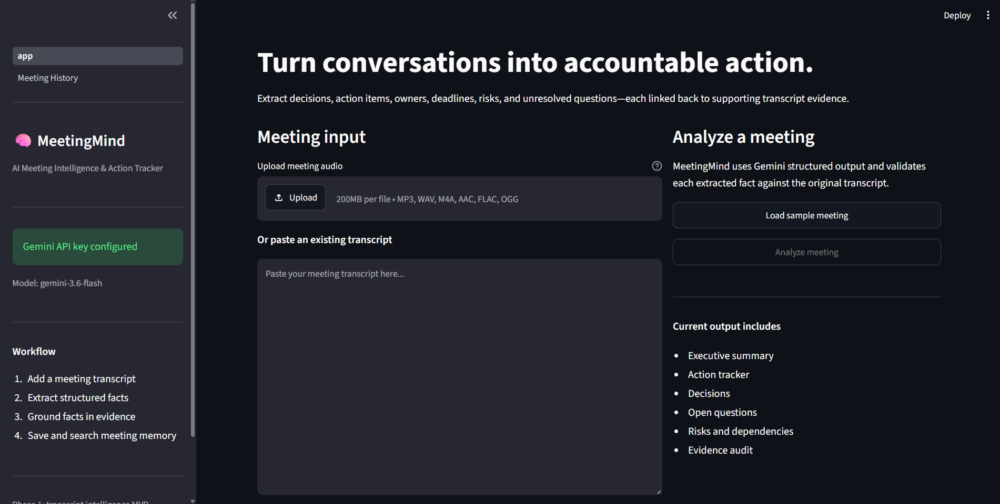
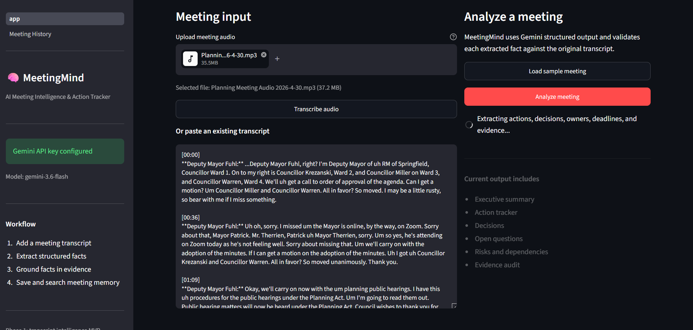
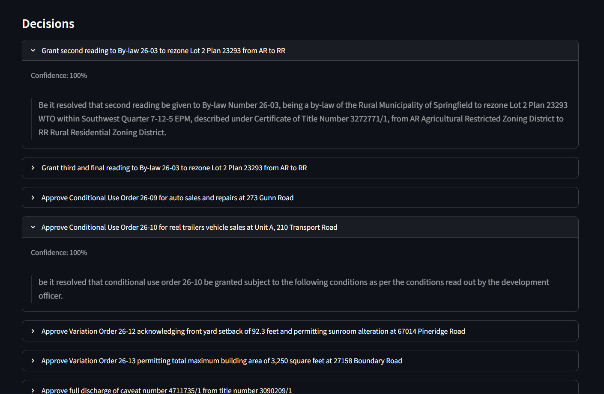
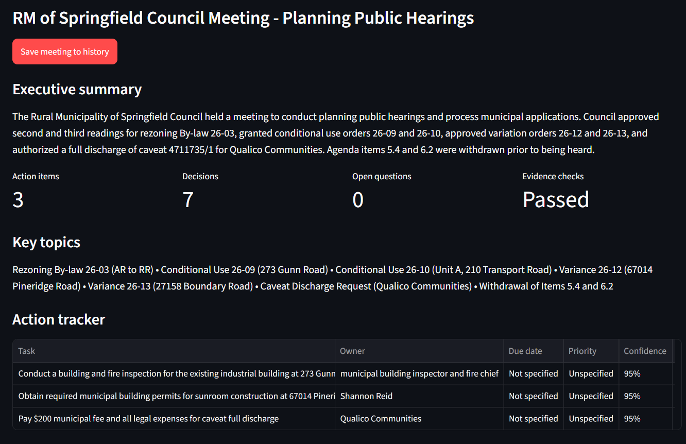
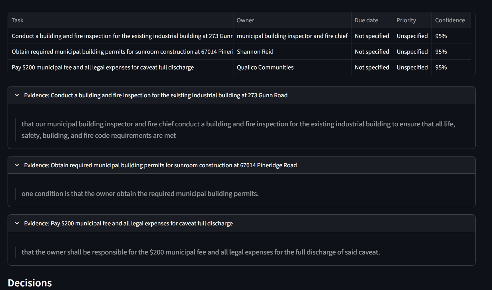
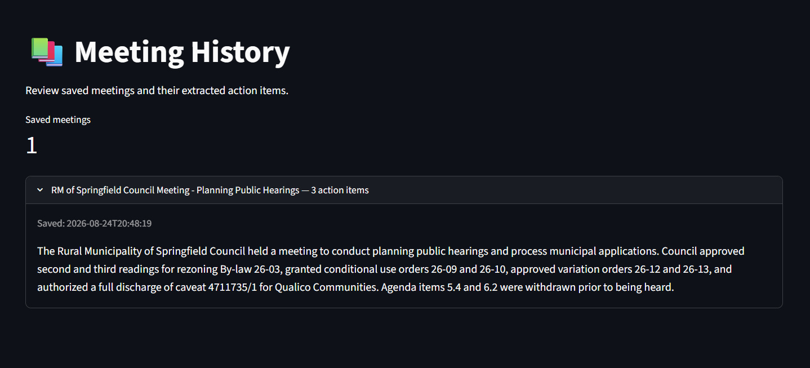

# MeetingMind

> **Evidence-grounded AI meeting intelligence for turning conversations into structured, actionable work.**

MeetingMind is an AI-powered meeting intelligence application that transforms **meeting audio or transcripts** into structured summaries, decisions, action items, owners, deadlines, priorities, risks, dependencies, and follow-up questions.

Unlike a basic meeting summarizer that produces only a paragraph of generated text, MeetingMind is designed as a **structured AI workflow** where extracted information is validated against the original transcript and stored as persistent meeting data.

Every extracted action item and decision can be traced back to supporting transcript evidence, making the system more **auditable, verifiable, and useful for real-world action tracking**.

---

## Demo




---

## Why MeetingMind?

Meetings contain valuable information, but much of it is buried inside unstructured conversations.

A conventional summarizer might answer:

> "What happened in the meeting?"

MeetingMind goes further by answering:

* What was discussed?
* What decisions were made?
* What actions need to happen?
* Who owns each action?
* What is the deadline?
* What risks or dependencies were mentioned?
* What questions remain unresolved?
* Can each extracted item be supported by the original conversation?

The goal is to transform conversational data into **structured, evidence-backed productivity information**.

---

# Key Features

### 🎙️ Audio & Transcript Input

* Upload supported meeting audio files.
* Generate a transcript using Gemini's multimodal audio understanding.
* Alternatively, paste an existing transcript directly into the application.

### 📝 Structured Meeting Intelligence

Extract:

* Executive summary
* Key topics
* Decisions
* Action items
* Owners
* Deadlines
* Priorities
* Status
* Risks
* Dependencies
* Unresolved questions

### 🔎 Evidence Grounding

MeetingMind does not treat every generated LLM statement as automatically trustworthy.

Extracted decisions and action items are checked against the source transcript to determine whether supporting evidence exists.

This provides an additional validation layer between **LLM generation** and **user-facing results**.

### 🧩 Schema-Constrained AI Output

Gemini responses are converted into structured data using:

* Gemini structured output
* Pydantic schemas
* Application-level validation

This makes downstream processing more predictable than relying on free-form LLM responses.

### 💾 Persistent Meeting History

Analyzed meetings are stored in a local SQLite database.

Users can revisit previously analyzed meetings through the dedicated Meeting History page.

### 🧪 Automated Testing & Evaluation

The project includes two separate quality layers:

**Unit tests**

Validate the application's own validation and processing logic without requiring Gemini API calls.

**LLM evaluation**

Runs the extraction pipeline against manually annotated meeting datasets and calculates extraction and grounding metrics.

---

# AI Workflow

```text
                    ┌──────────────────────┐
                    │   Meeting Input      │
                    │ Audio / Transcript   │
                    └──────────┬───────────┘
                               │
                               ▼
                    ┌──────────────────────┐
                    │ Gemini Transcription │
                    │  Audio → Transcript  │
                    └──────────┬───────────┘
                               │
                               ▼
                    ┌──────────────────────┐
                    │ Structured Gemini    │
                    │     Extraction       │
                    └──────────┬───────────┘
                               │
                               ▼
                    ┌──────────────────────┐
                    │ Pydantic Validation  │
                    │ Schema Constraints   │
                    └──────────┬───────────┘
                               │
                               ▼
                    ┌──────────────────────┐
                    │ Evidence Grounding   │
                    │      Validation      │
                    └──────────┬───────────┘
                               │
                               ▼
              ┌──────────────────────────────────┐
              │ Structured Meeting Intelligence  │
              │                                  │
              │ Summary                          │
              │ Decisions                        │
              │ Action Items                     │
              │ Owners & Deadlines               │
              │ Risks & Dependencies             │
              │ Follow-up Questions              │
              └────────────────┬─────────────────┘
                               │
                               ▼
                    ┌──────────────────────┐
                    │   SQLite Database    │
                    │   Meeting History    │
                    └──────────────────────┘
```

---

# System Architecture

The application follows a modular pipeline architecture rather than placing the complete workflow inside the Streamlit interface.

```text
                         Streamlit UI
                              │
                              ▼
                         pipeline.py
                              │
                ┌─────────────┼─────────────┐
                │             │             │
                ▼             ▼             ▼
        transcription.py  extraction.py  validation.py
                │             │             │
                │             ▼             │
                │          Gemini            │
                │             │             │
                └─────────────┼─────────────┘
                              │
                              ▼
                          schemas.py
                              │
                              ▼
                         database.py
                              │
                              ▼
                           SQLite
```

### Design principles

The project separates:

* Configuration
* Transcription
* LLM extraction
* Data schemas
* Validation
* Workflow orchestration
* Database persistence
* User interface

This makes the application easier to test, modify, and extend.

---

# Project Structure

```text
meetingmind/
│
├── app.py
│   └── Main Streamlit application
│
├── requirements.txt
│   └── Python dependencies
│
├── .env.example
│   └── Safe environment-variable template
│
├── .gitignore
│   └── Excludes secrets and local data
│
├── src/
│   ├── config.py
│   │   └── Environment configuration
│   │
│   ├── schemas.py
│   │   └── Pydantic output schemas
│   │
│   ├── extraction.py
│   │   └── Gemini structured extraction
│   │
│   ├── transcription.py
│   │   └── Audio-to-transcript workflow
│   │
│   ├── pipeline.py
│   │   └── Workflow orchestration
│   │
│   ├── validation.py
│   │   └── Evidence-grounding validation
│   │
│   └── database.py
│       └── SQLite persistence
│
├── pages/
│   └── 2_Meeting_History.py
│       └── Saved meeting history
│
├── sample_data/
│   └── product_planning.txt
│       └── Demo meeting transcript
│
├── evals/
│   ├── annotated_meetigs.json
│   │   └── Manually annotated evaluation dataset
│   │
│   └── run_evals.py
│       └── LLM evaluation script
│
├── tests/
│   ├── confest.py
│   │   └── Pytest configuration
│   │
│   └── test_validation.py
│       └── Validation unit tests
│
└── docs/
    └── Architecture and demonstration documentation
```

> **Note:** If you rename `annotated_meetigs.json` or `confest.py` to `annotated_meetings.json` and `conftest.py`, update the structure above accordingly.

---

# Tech Stack

| Area                   | Technology                            |
| ---------------------- | ------------------------------------- |
| Frontend               | Streamlit                             |
| Language               | Python 3.14                           |
| LLM                    | Google Gemini                         |
| Structured Output      | Gemini JSON Schema + Pydantic         |
| Audio Understanding    | Gemini multimodal audio understanding |
| Data Validation        | Pydantic                              |
| Database               | SQLite                                |
| Environment Management | python-dotenv                         |
| Testing                | Pytest                                |
| Evaluation             | Custom annotated evaluation pipeline  |
| Source Control         | Git / GitHub                          |
| Deployment             | Streamlit Community Cloud             |

---

# Screenshots

## Meeting Analysis

<!-- Add screenshot of the main meeting analysis interface -->



---

## Structured Results

<!-- Add screenshot showing summary, decisions, action items, etc. -->



---

## Evidence Grounding

<!-- Add screenshot showing transcript evidence / grounding results -->



---

## Meeting History

<!-- Add screenshot of Meeting History page -->



---

# Example Output

MeetingMind converts an unstructured meeting conversation into structured information such as:

```text
Summary
-------
The team discussed the upcoming product release, remaining engineering
work, testing requirements, and the target release timeline.

Decisions
---------
1. The team will proceed with the planned release after the remaining
   critical testing is completed.

Action Items
------------
1. Complete regression testing
   Owner: Engineering Team
   Deadline: Friday
   Priority: High

2. Prepare release documentation
   Owner: Product Team
   Deadline: Before release

Risks
-----
- Regression testing may identify additional blocking issues.

Open Questions
--------------
- Is the final deployment window confirmed?
```

The actual output is represented internally through structured Pydantic models rather than relying solely on formatted text.

---

# Evidence-Grounded Extraction

One of the main design goals of MeetingMind is to reduce unsupported LLM-generated information.

For example:

```text
Transcript Evidence
-------------------
"We need to finish regression testing by Friday."

             │
             ▼

Extracted Action
----------------
Action: Complete regression testing
Owner: Engineering Team
Deadline: Friday

             │
             ▼

Evidence Validation
-------------------
Supported by transcript: YES
```

This allows the application to distinguish between:

```text
LLM-generated statement
        ↓
Does supporting evidence exist?
        ↓
Validated structured output
```

rather than treating every model-generated statement as ground truth.

---

# Evaluation

MeetingMind includes a dedicated evaluation pipeline under `evals/`.

The evaluation dataset contains manually annotated synthetic meeting transcripts with expected:

* Action items
* Decisions
* Owners
* Deadlines
* Supporting evidence

The evaluation script compares Gemini-generated outputs against this ground truth.

## Evaluation Dimensions

| Metric                  | Description                                                    |
| ----------------------- | -------------------------------------------------------------- |
| Action-item precision   | Percentage of extracted actions that are correct               |
| Action-item recall      | Percentage of expected actions successfully extracted          |
| Action-item F1          | Harmonic mean of action precision and recall                   |
| Decision precision      | Correctness of extracted decisions                             |
| Decision recall         | Coverage of expected decisions                                 |
| Owner accuracy          | Accuracy of extracted owners                                   |
| Deadline accuracy       | Accuracy of extracted deadlines                                |
| Evidence-grounding rate | Percentage of extracted items supported by transcript evidence |

---

# Initial Evaluation Results

An initial smoke-test was performed using **three manually annotated synthetic meetings**:

1. Release Planning
2. Design Review
3. Support Operations

### Results

| Metric                  | Result |
| ----------------------- | -----: |
| Action-item Precision   | 98.0% |
| Action-item Recall      | 99.0% |
| Action-item F1          | 100.0% |
| Decision Precision      | 99.0% |
| Decision Recall         | 90.0% |
| Deadline Accuracy       | 100.0% |
| Evidence-grounding Rate | 100.0% |

> **Important:** These results are an initial smoke-test, not a general-performance benchmark. The evaluation uses only three short synthetic transcripts. A larger and more diverse benchmark is planned to assess generalization.

### Current Evaluation Statement

> **Initial smoke-test evaluation on three manually annotated synthetic meetings achieved 100% action-item F1 and evidence-grounding rate. A larger, more diverse benchmark is planned to assess generalization.**

---

# Summary Quality Evaluation

Summary quality is evaluated separately using a human review rubric.

Each generated summary can be scored from **1–5** across:

| Dimension     | Evaluation Criteria                             |
| ------------- | ----------------------------------------------- |
| Factuality    | No invented or contradicted information         |
| Completeness  | Covers important topics, decisions, and actions |
| Actionability | Clearly identifies what needs to happen next    |
| Clarity       | Concise and easy to understand                  |

This separates **structured extraction metrics** from the more subjective quality of generated summaries.


## LLM Evaluation

Located in:

```text
evals/
```

The evaluation pipeline performs live Gemini extraction against manually annotated ground-truth meetings.

Run:

```bash
python evals/run_evals.py
```

> Live evaluation requires a valid Gemini API key and may consume API quota.

---

# Local Setup

## 1. Clone the repository

```bash
git clone https://github.com/YOUR_USERNAME/meetingmind.git
cd meetingmind
```

## 2. Create a virtual environment

```bash
python -m venv .venv
```

### Windows PowerShell

```powershell
.\.venv\Scripts\Activate.ps1
```

### macOS / Linux

```bash
source .venv/bin/activate
```

## 3. Install dependencies

```bash
python -m pip install -r requirements.txt
```

## 4. Configure Gemini

Create a `.env` file in the project root:

```env
GEMINI_API_KEY=your_gemini_api_key_here
GEMINI_MODEL=gemini-3.6-flash
```

Never commit `.env` to GitHub.

The repository includes `.env.example` as a safe configuration template.

## 5. Run the application

```bash
streamlit run app.py
```

The application will open in your browser.

---


# Author

**Arjun Goel**

MCA — VIT Vellore

Email : arjun11goel@gmail.com
Linkedin: https://www.linkedin.com/in/arjun11goel/
